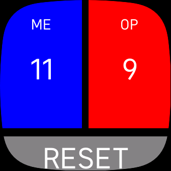

# Squash Game Tracker

This is a fitbit app compatible with the Versa 3 and the Sense model.

During my squash matches I often find during the intense gameplay we can lose track of the current score.
Often leading to a guess being made or a small dispute. As I often wear my Sense to my matches it made sense to add a little tracker app.

This was built using the [Fitbit SDK](https://dev.fitbit.com/) and Node 14 which is the latest version the Fitbit SDK currently supports.

## Building and Testing

You can run `npx fitbit` to open up the fitbit console. Then using either the fitbit simulator or the developer bridge on your fitbit device build and install your application.

## Future Development

There are a few things I would still like to do

1. Add support for multiple games, best of 5.
2. Keep track of heart rate, point timings, etc and export that data after my game is complete.
